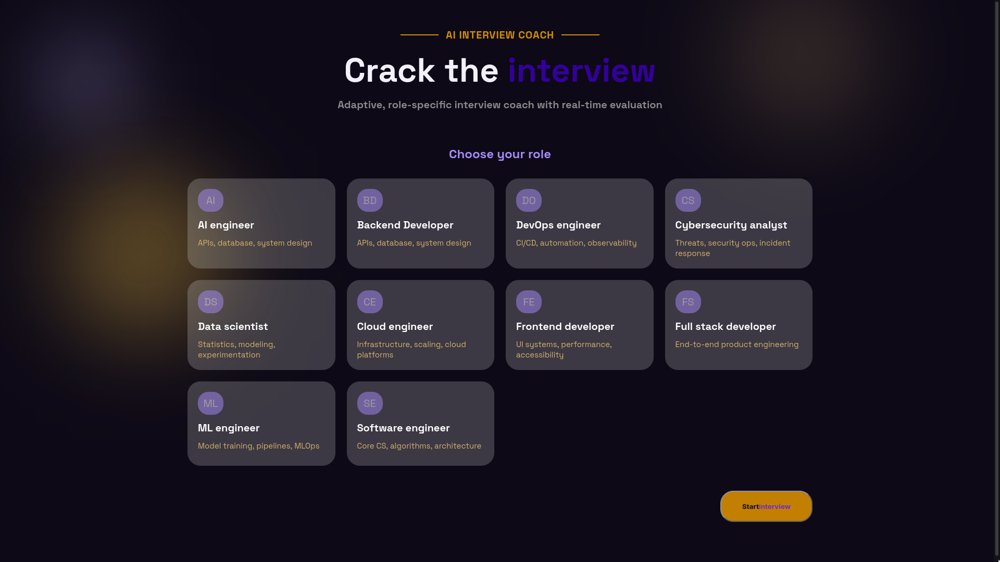

# Crack

## What is Crack??
- Crack is an AI Interview Coach.
- User can choose a role they want to practice.
- The interview session is made smart enough that the number of questions and difficulty increment will depend on the quality of answers answered by the user by taking average of score of all questions asked previously.
- I have stored questions in JSON files.
- I have implemented a engine which pulls question from that JSON databases of questions.
- After the questions are answered it is sent to AI for evaluation, i made a special prompt for it which is send to the AI.
- I used Hack Club's AI APIs for this project, the AI the evaluates the answers is Claude Sonnet-5
- So the only thing AI does is evaluation because there should be some sort of intelligence to evaluate the answers

## What is used?
- I used Python for Backend.
- Implemented OOP for interview session and question pulling from data base.
- Implemented OOP for interview engine to make it smart enough to increment difficulty and how many number of questions to be asked in one interview session.
- Used Flask framework to connect backend with frontend.
- Used HTML and CSS for frontend.
- Used Javascript just for making the timer dynamic during interview.
- Deployed on Render.

## Notes:
- There are total of 4 difficulty levels Easy, Medium, Hard and Scenario.
- Scenario based questions are basically about real life problems.
- Designed frontend on figma which is timelapsed.
- Since it is deployed on render for free, so it will take some time to wake up system and then display my project when you visit the site.
- There are total of 10 CS roles in which different topics/area of field of questions are stored in JSON files, given unique keys to each questions.

## How to use?
- Here is the URL -> https://crack-5jq3.onrender.com/
- When homepage is displayed you have option to choose for which role you want to practice interview questions.
- After choosing the role you have to click "Start Interview" option on the bottom-right corner of the page.
- After that you will be taken to another route where your timer and interview session starts.
- You answer the questions asked in the text-area provided.
- Number of questions asked are not pre-decided, it is decided by the engine which i wrote
- The difficulty imcrements according to user's answer. 
